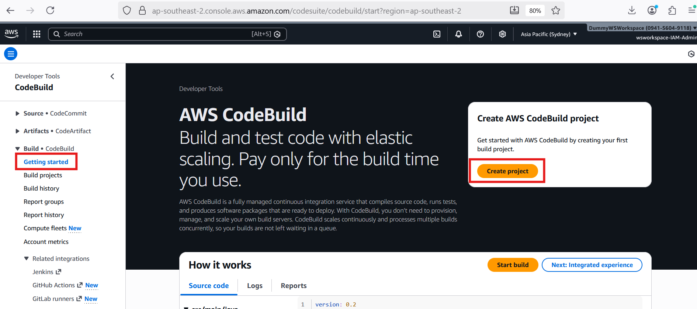
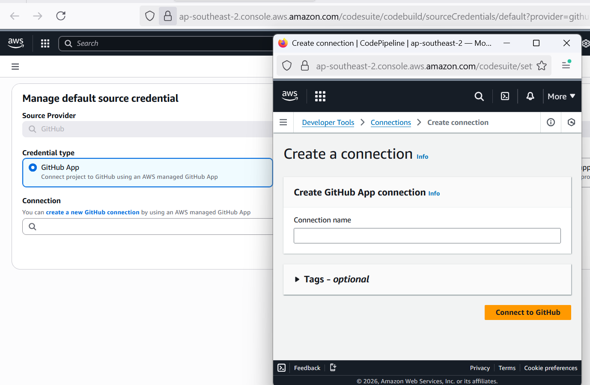
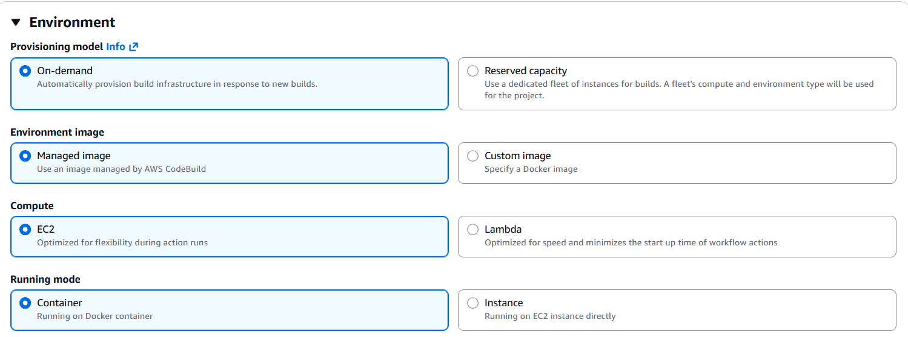
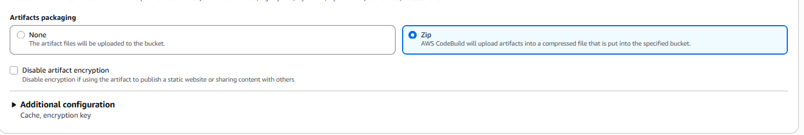
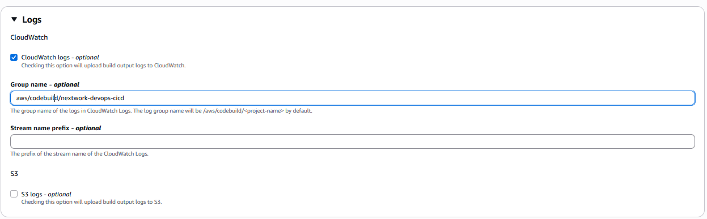
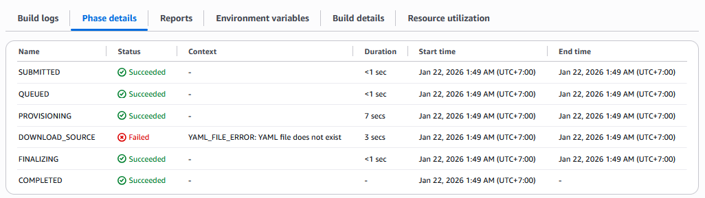

# 🏗️ Continuous Integration with CodeBuild

**Project Link:** [View Project](http://learn.nextwork.org/projects/aws-devops-codebuild-updated)

**Author:** Ngurah Gede Wisnu Gudakesa  
**Email:** ngurahgedewisnugk@gmail.com

---

---

## 🚀 Introducing Today's Project!

In this project, I will demonstrate how **Continuous Integration (CI)** with **AWS CodeBuild** automates the process of turning code into a deployable package. I'm doing this to understand how CodeBuild ensures applications are built consistently and correctly as an essential part of CI/CD pipelines.

## 🛠️ Key Tools and Concepts

### Services Used
- **AWS CodeBuild:** Managed build service that compiles source code, runs tests, and produces software packages.
- **GitHub:** Source code management and version control.

### Key Concepts Learned
- ✅ Creating and configuring a CodeBuild project from scratch.
- ✅ Connecting CodeBuild to a GitHub repository via secure bridges.
- ✅ Defining the build process using a `buildspec.yml` file.
- ✅ Automating testing within the build lifecycle.

---

## 💭 Project Reflection

> **Time Investment:** ~4 hours

### Challenges Faced
The most challenging part was re-setting up the development environment, storing dependencies in CodeArtifact, and establishing the CodeConnection to GitHub.

### Most Rewarding Moment
Successfully re-establishing the setup and connecting to GitHub, which solidifies the foundation for the entire CI/CD pipeline.

> 📌 **Note:** This is part four of my DevOps series! Tomorrow, I'll be working on **Deploying an App with CodeDeploy**.

---

## 🏗️ Setting up a CodeBuild Project

A CI service like AWS CodeBuild is primarily about **Continuous Integration**. This means it automatically takes your web app's code, along with all its necessary packages and dependencies, and processes them. It compiles, runs tests, and packages everything into a deployable file. 

### Why Engineering Teams Use It:
- **Automation:** Saves time and reduces manual errors.
- **Consistency:** Ensures code changes are always checked for compatibility.
- **Scalability:** Handles the heavy lifting without the need to manage physical build servers.

---

## 🔗 Connecting CodeBuild with GitHub

I explored different credential types for GitHub integration:

| Credential Type | Description |
|:---|:---|
| **GitHub App** | **(Used)** Simplest and most secure. AWS manages the connection. |
| **Personal Access Token** | Slightly risky; requires manual rotation and management. |
| **OAuth App** | Granular control but more complex to set up than GitHub App. |

### AWS CodeConnection

I used GitHub App because it's the simplest and most secure option. So AWS handles all the credentials to Github App.

The service that helped connect is `AWS CodeConnection`, it's like a secure bridge between AWS and my external code repositories (`Github`), AWS handles all that authentication complexity, This means you don't have to worry about managing things like API keys, Personal Access Tokens, or SSH credentials , so we can focus on building the application. 

---

## ⚙️ CodeBuild Configurations

### 🖥️ Environment

My CodeBuild project's environment configuration defines the operating system, runtime, and compute resources for builds. I set it up as follows:
- **Provisioning Model:** On-demand (Cost-effective; resources are created only during builds).
- **Compute Type:** EC2 (Flexible power for Java Corretto 8 applications).
- **Environment Image:** AWS Managed (Amazon Linux with Standard runtime).
- **Service Role:** A dedicated IAM role to grant CodeBuild permissions (e.g., storing artifacts in Amazon S3 access).

### :bookmark_tabs: Artifacts

The S3 bucket will store the build artifacts produced by CodeBuild. For my project, the key artifact is a WAR file (Web Application Archive). This WAR file is a neat bundle containing everything a server needs to host our web application. Amazon S3 provides a reliable and scalable place to store this deployable application version.

### 📦 Packaging

When setting up CodeBuild, I also chose to package artifacts in a zip file because it's reduce sizing of my artifact, so package artifact can uploading faster to S3 and less storage costs, managing mutiple individual files on one tidy package, and much more straightforward when working with other teammates, only with download one file and you have everything you need.

### 📊 Monitoring

For monitoring, I enabled CloudWatch Logs, to monitor my CodeBuild processes, It collects and tracks all logs. including the command that are run, the output of commands, and any error that occur. which is incredibly useful for debugging and understanding what happens during a build.

---
## 📄 buildspec.yml
### Challange : File does not exist

My first build failed because CodeBuild couldn't find my build spec file `(YAML_FILE_ERROR: YAML file does not exist)`. A `buildspec.yml` file is needed because CodeBuild need to defined as code right alongside my application. This means my build process can be versioned, reviewed, and evolved just like any other part of my codebase.

### In my `buildspec.yml` contain : 
1.  `Version`: This specifies the version of the AWS BuildSpec format being used.
2. `Phases`: These define the different stages your build goes through:
    - `Install`: This is the "prep-work" phase where the necessary runtime environment, like Java 8, is set up.
    - `Pre-build`: Tasks executed before the main build starts, such as initializing the environment and obtaining an authorization token to access dependencies from CodeArtifact.
	- `Build`: This is the core phase where the actual building happens, compiling the code with a package manager like Maven.
	- `Post-build`: These are the finishing touches after the main build is done, packaging everything into a single WAR file.
3. `Artifacts`: This section tells CodeBuild which files to save as the output of the build. In this project, it's the WAR file that will be stored in Amazon S3.

---

## Challange : Error While Executing Command 

### The Problem : 
My second build also failed , but with a different error that said `"COMMAND_EXECUTION_ERROR: Error while executing command:"` which means CodeBuild failed to executing the structure compile command and download dependencies using the `settings.xml` file for my web app to CodeArtifact, because the CodeBuild service role lacked the necessary permissions to access CodeArtifact. To fix this need to grant my CodeBuild project's IAM role the correct permissions to interact with CodeArtifact.

### The Solution : 

To resolve the second error, I granted my CodeBuild project the necessary permission to access CodeArtifact with attaching the IAM policies with naming `codeartifact-nextwork-consumer-policy` to its service role like the same permission that I gave to EC2 Instance. After doing this, the build process completed successfully.

## 🎉 Success!

To verify the build :  
1. I checked the S3 bucket named `nextwork-devops-cicd-wsworkspace`. 

2. The file created was `wsworskspace-artifact.zip`, 

3. which contains `nextwork-web-project.war` file. 

This confirmed that my code was successfully compiled and packaged, and the artifact was properly uploaded to its destination.

---

## 🧪 Automating Testing

In a project extension, I'm adding an Simple Test Script verifies the integrity of the Java web application, I added a test script that checks : 
- ✅ Checking Project Structure 
- ✅ ensuring all necessary web files are present
- ✅ validating the overall structure of the project.

This helps confirm that the application is correctly set up for `Continuous Integration(CI)`

### Integration Steps:
To add the test script to the build process, I updated my `buildspec.yml` file. Within this file :
1.  I added commands to the appropriate phase (typically the build phase) to Execute my run-tests.sh script. This tells CodeBuild to automatically run my Tests as part of the continuous integration process. 

2. After successful testing, the buildspec.yml then instructs CodeBuild to Package up the application, making it ready for deployment. I also included Specific markers to help track the progress of the build process.

3. After pushing my code to GitHub, I re-ran my CodeBuild project. To verify that automated testing was successful, I navigated to the Phase Details and checked the build logs. I specifically looked for output that confirmed the execution of my unit tests for the Java web application and indicated that all tests passed within the build process.

---

