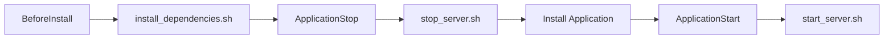

 # 🚀 Deploy a Web App with AWS CodeDeploy

**Project Link:** [View Project](http://learn.nextwork.org/projects/aws-devops-codedeploy-updated)

**Author:** Ngurah Gede Wisnu Gudakesa  
**Email:** ngurahgedewisnugk@gmail.com

---


---

## 🎯 Introducing Today's Project!

In this project, I will demonstrate how to deploy my web app using **AWS CodeDeploy**. I'm doing this to learn the process of automating deployments, ensuring my web application is consistently and reliably made available to users.

## 🛠️ Key Tools and Concepts

The following AWS services and tools were utilized throughout this project:

| Tool/Service | Purpose |
|--------------|---------|
| **VS Code** | Code editor for development |
| **GitHub** | Version control and code repository |
| **AWS CodeArtifact** | Securely manage dependencies and packages |
| **AWS CodeBuild** | Compile and package application into deployable WAR file |
| **AWS CodeDeploy** | Automate deployment to web servers |
| **AWS CloudFormation** | Provision and manage infrastructure as code (IaC) |
| **Amazon EC2** | Host the production web application |
| **Amazon VPC** | Network isolation and security |

### Architecture Overview

```
GitHub → CodeBuild → S3 (Artifacts) → CodeDeploy → EC2 (Production)
```

## 💭 Project Reflection

**Time to Complete:** ~8 hours

### Challenges Faced

The most challenging aspects of this project were:

1. **Rebuilding the development environment** from scratch
2. **Understanding deployment concepts** comprehensively
3. [**Troubleshooting failed deployments**]() - specifically, the CodeDeploy Agent not being installed on the instance

Despite these challenges, I persevered and worked through each issue step by step, gaining valuable hands-on experience with AWS deployment automation.

---

## 🌐 Deployment Environment


Instead of manually launching resources, I used **AWS CloudFormation** to provision infrastructure as code (IaC). This approach allows me to:

- ✅ Set up multiple resources (EC2, VPC, networking) as a single unit
- ✅ Ensure repeatability and consistency
- ✅ Delete all resources with one command
- ✅ Separate development and production environments

### Resources Created

The CloudFormation template provisions:

- **VPC** - Virtual Private Cloud for network isolation.

- **Subnet** - Network segment within the VPC.

- **Route Table** - Routing rules for network traffic.

- **Internet Gateway** - Enable internet connectivity.

- **Security Group** - Firewall rules for the EC2 instance

- **EC2 Instance** - Production web server

> **Why separate environments?** Separating development and production environments prevents untested code changes from affecting live users.

---

## 📜 Deployment Scripts

Scripts automate specific actions during the application's deployment with AWS CodeDeploy. These bash scripts ensure a smooth, automated deployment process.

### Script Execution Order


### 1. `install_dependencies.sh`


**Purpose:** Set up necessary software before the new application version is installed.

**Actions:**
- Installs **Apache Tomcat** (Java application server)
- Installs **Apache HTTP Server** (httpd - web server)
- Configures Apache as a **reverse proxy** to forward requests to Tomcat
> **Reverse Proxy:** Apache receives user requests and forwards them to Tomcat, which runs the actual application.

### 2. `stop_server.sh`


**Purpose:** Safely stop web server services before updating.

**Actions:**
- Checks if Apache (httpd) and Tomcat are running using `pgrep`
- Stops services only if they're active
- Prevents errors during deployment

> **Why check first?** This makes the script more robust by avoiding errors when trying to stop services that aren't running.

### 3. `start_server.sh`


**Purpose:** Start services after the new application is installed.

**Actions:**
- Starts both Tomcat and Apache web server
- Configures services to automatically restart on EC2 instance reboot
- Ensures the web application remains available
---

## 📄 AppSpec Configuration


The appspec.yml file acts as an manual instruction for AWS CodeDeploy, telling it exactly what to do and when to do it during my web app deployment. 

### Key Sections

#### 1. **Files**
Directs build artifacts (WAR files) from S3 to the Tomcat directory on the web server.

```yaml
files:
  - source: /target/nextwork-web-project.war
    destination: /usr/share/tomcat/webapps/
```

#### 2. **Hooks**
Deployment lifecycle events where CodeDeploy executes custom scripts:

| Hook | Script | Purpose |
|------|--------|---------|
| **BeforeInstall** | `scripts/install_dependencies.sh` | Install dependencies (Tomcat, Apache) |
| **ApplicationStop** | `scripts/stop_server.sh` | Safely stop services |
| **ApplicationStart** | `scripts/start_server.sh` | Start the deployed application |

### Updated `buildspec.yml`

I modified the `buildspec.yml` file to include the `appspec.yml` and `scripts/` folder in the build artifacts:

```yaml
artifacts:
  files:
    - target/nextwork-web-project.war
    - appspec.yml
    - scripts/**/*
```

> **Why include these?** CodeDeploy needs the `appspec.yml` to understand the deployment process and the scripts to execute during lifecycle events.

---

## ⚙️ Setting Up CodeDeploy

### CodeDeploy Application vs. Deployment Group

| Component | Description |
|-----------|-------------|
| **CodeDeploy Application** | Container/organizing unit for all deployment components |
| **Deployment Group** | Specifies deployment configuration and target instances for a specific environment (dev, prod) |

### IAM Role for CodeDeploy

CodeDeploy requires an IAM role with permissions to:

- ✅ Access target EC2 instances
- ✅ Read application artifacts from S3 buckets
- ✅ Update Auto Scaling groups
- ✅ Write CloudWatch logs for monitoring

> **Principle of Least Privilege:** CodeDeploy only receives the minimum permissions needed to perform its job securely.

### Using Tags to Target Instances


I used the tag `role: webserver` to identify target EC2 instances for deployment.

**Benefits of using tags:**

1. **Flexibility** - New instances with the same tag are automatically included
2. **Self-documentation** - Tags clearly explain what an instance does
3. **Integration** - CloudFormation template automatically tags instances

---

## 🔧 Deployment Configurations


I used **`CodeDeployDefault.AllAtOnce`** because this project has only one instance and is for learning purposes.

### Production Considerations

For production environments, more conservative options are recommended:

| Strategy | Description | Use Case |
|----------|-------------|----------|
| **AllAtOnce** | Deploy to all instances simultaneously | Single instance or dev/test |
| **OneAtATime** | Update one instance at a time | Minimize risk, verify each step |
| **HalfAtATime** | Update half of instances, then the rest | Balance speed and safety |

### CodeDeploy Agent

The **CodeDeploy Agent** runs on EC2 instances and:
- Receives instructions from CodeDeploy
- Executes deployment scripts
- Reports deployment status
---
## 🚨 Challange : Got Failure at running Deployments 


### The Problem
During my initial deployment attempt, I encountered a critical failure: 
```The overall deployment failed because too many individual instances failed deployment, too few healthy instances are available for deployment, or some instances in your deployment group are experiencing problems.```

### Root Cause Analysis

After investigating, I discovered the root cause was:

> **❌ IAM Role Missing CodeDeploy Permissions**
> 
> The EC2 instance did not have an IAM instance profile attached with the necessary permissions for CodeDeploy operations.

### Diagnostic Steps :

#### 1. **Verify IAM Instance Profile**

**Steps to check:**
1. Navigate to **EC2 Console** → Select my instance
2. Check the **"IAM instance profile"** field in the instance details
3. Verify the attached role has the `AmazonEC2RoleforAWSCodeDeploy` policy.

**What I found:**
- ❌ No IAM instance profile was attached to the EC2 instance
- ❌ Without proper permissions, the instance couldn't download the CodeDeploy Agent or communicate with CodeDeploy service.

#### 2. **Check CodeDeploy Agent Status (Using Systems Manager)**

Since I couldn't SSH, I used **AWS Systems Manager Session Manager** to check the agent status:

1. Go to **AWS Systems Manager** → **Session Manager**
2. Click **"Start session"**
3. Select your EC2 instance
4. Click **"Start session"**
5. Run the following command in the browser-based terminal:

```bash
sudo service codedeploy-agent status
```

**The output:**
```
codedeploy-agent: command not found.
```
### Resolution Steps

#### Step 1: Attach IAM Role to EC2 Instance

Since the instance was created by CloudFormation without proper IAM permissions, I needed to attach an IAM role manually:

1. **Create or Update IAM Role:**
   - Go to **IAM Console** → **Roles**
   - Create a new role or select an existing one
   - Attach the following **AWS managed policies**:
     - `AmazonEC2RoleforAWSCodeDeploy` - Allows CodeDeploy operations

2. **Attach Role to EC2 Instance:**
   - Go to **EC2 Console** → Select your instance
   - **Actions** → **Security** → **Modify IAM role**
   - Select the IAM role you created/updated
   - Click **"Update IAM role"**

3. **Wait for Systems Manager to Recognize the Instance:**
   - After attaching the role, wait 5-10 minutes
   - Go to **Systems Manager** → **Fleet Manager**
   - Verify my instance appears in the list

#### Step 2: Install CodeDeploy Agent via AWS Systems Manager
Since I couldn't use SSH, I used **AWS Systems Manager Distributor** to remotely install the CodeDeploy Agent.

**Why Systems Manager?**
- ✅ No SSH access required
- ✅ Works with CloudFormation-created instances
- ✅ Centralized management through AWS Console
- ✅ Can install on multiple instances simultaneously
- ✅ Automated and repeatable
- ✅ Provides audit logs of all operations

4. **Monitor Installation Progress**
   - Go to **Systems Manager** → **Run Command**
   - Find my command execution in the list
   - Click on the **Command ID** to view details
   - Monitor the **"Status"** column
   - Wait for status to show **"Success"** ✅
   

5. **Verify Installation Using Systems Manager**
   
   - After Installation, check the column **View Output**.
   - Then Scroll Down, and Check page **Command description and status**
    

### Reference Documentation

- 📚 [Install CodeDeploy Agent using Systems Manager](https://docs.aws.amazon.com/codedeploy/latest/userguide/codedeploy-agent-operations-install-ssm.html)
- 📚 [Deploy Packages with Distributor](https://docs.aws.amazon.com/systems-manager/latest/userguide/distributor-working-with-packages-deploy.html#distributor-deploy-pkg-console)
- 📚 [NextWork Community](https://community.nextwork.org/)
---

## ✅ Success!


### Understanding Deployments
| Concept | Description |
|---------|-------------|
| **Deployment Group** | Sets up the environment and rules for where/how application changes are rolled out |
| **Deployment** | The actual execution that orchestrates the process (stopping services, copying files, running scripts) |

### Revision Location


The revision location is where CodeDeploy looks to find my application's build artifacts. In this project, it's the S3 Bucket where my WAR files (the compressed, ready-to-deploy web application) are stored. I'm configure it this way because my CodeBuild process automatically places the build artifacts into that S3 bucket, ensuring CodeDeploy always deploys the latest version of my web app.

### Verification

To verify the deployment was successful, I visited the **public IPv4 DNS address** of the deployed EC2 instance and saw the live web application serving content to end users! 🎉


---

## Disaster Recovery

### Simulating a Failed Deployment


I introduced a typo in the stop_server.sh script, changing command scripts from systemctl to systemctll. This intentional error causes the deployment to fail because CodeDeploy attempts to run a non-existent command. Then triggers CodeDeploy's automatic rollback mechanism, which is essential for ensuring application stability and serves as a form of disaster recovery by reverting to the last known good version.

### Automatic Rollback


I also enabled rollbacks with this deployment, which means  to automatically revert a failed deployment to the last stable version of the application. crucial for disaster recovery because it minimizes downtime and ensures application stability by quickly undoing changes that break the system, and it is also more efficient for the team to perform troubleshooting the issue without the pressure of a broken production environment.

### Recovery Process


When my deployment failed, the automatic rollback failed to work because CodeDeploy still referencing the lastest build artifact available in S3, which still contain my broken scripts (i.e.. `stop_server.sh`) 

To actually recover from beginning I'd have to : 
1. fix the broken scripts locally. 
2. commit and push my fixed scripts to repository. 
3. rebuild artifact again with CodeBuild.
4. Deploy the fixed version In production environments to revert previous known-good version.


---
