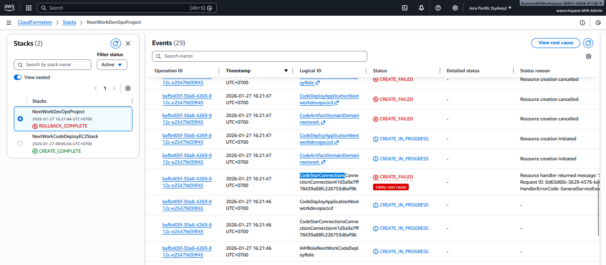
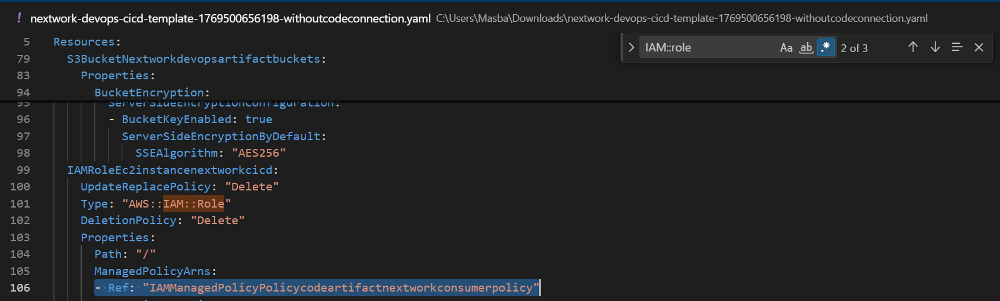
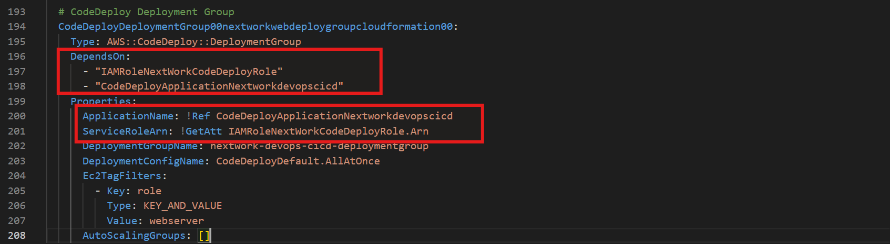
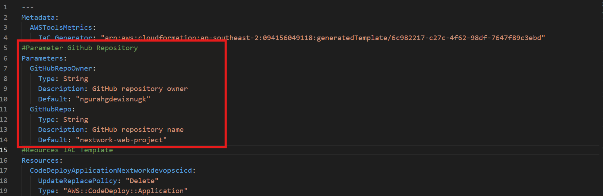
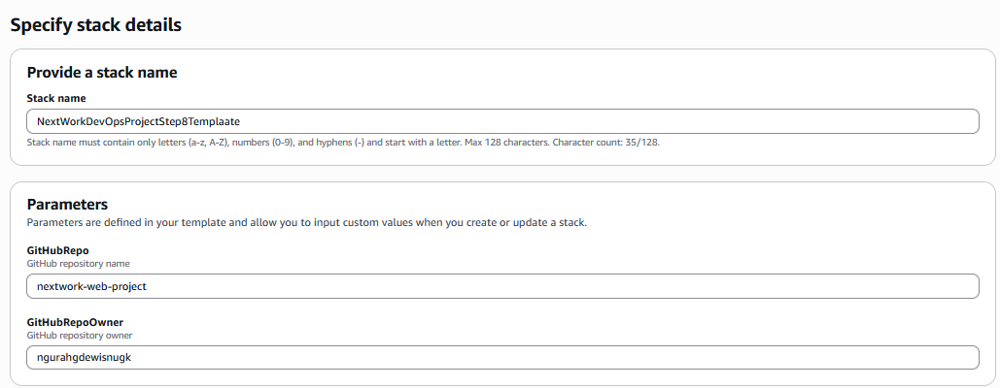

# Infrastructure as Code with CloudFormation

**Project Link:** [View Project](http://learn.nextwork.org/projects/aws-devops-cloudformation-updated)

**Author:** Ngurah Gede Wisnu Gudakesa  
**Email:** ngurahgedewisnugk@gmail.com

---

---

## 🎯 Introducing Today's Project!

In this project, I demonstrate how to transform CI/CD infrastructure into **Infrastructure as Code (IaC)** using AWS CloudFormation. This approach enables creating all necessary resources correctly and consistently, saving time and reducing the risk of manual errors compared to setting them up individually.

### 🛠️ Key tools and concepts

### **AWS Services Used:**
- **CloudFormation** - Central service for creating resources from templates
- **CodeArtifact** - Artifact repository management
- **CodeDeploy** - Application deployment automation
- **CodeBuild** - Build and packaging service
- **IAM** - Roles and policies management
- **S3** - Storage for artifacts

### **Key Concepts Learned:**
- ✅ Generating CloudFormation templates using the IaC Generator
- ✅ Troubleshooting and fixing circular dependencies
- ✅ Manually adding resource definitions to templates
- ✅ Making templates reusable with parameterization
- ✅ Transforming CI/CD infrastructure into code

---

## 💭 Project Reflection

> **Duration:** ~8 hours

The most challenging aspect was troubleshooting the initial stack deployment, particularly dealing with a CodeStar-Connection region mismatch error. After resolving that, I encountered additional errors which I successfully fixed with guidance. Exploring these challenges and solving them made the entire process feel smooth and satisfying.

**This is part 6 of a DevOps project series** where I'm building a complete CI/CD pipeline! 🚀

---

## Generating a CloudFormation Template

The IaC Generator is a tool within CloudFormation Console that significantly speeds up template creation.  It works by scanning my AWS account to discover existing resources and then generates the code for those resources that I want to include in a CloudFormation template. This means I don't need to write the code from scratch.

#### **Three-Step Process:**
1. **Scan** all resources in the AWS account
2. **Create** a template bundling the resources to manage together
3. **Import** the template into CloudFormation for deployment

### CloudFormation Template 

A CloudFormation template is essentially a text file where to define all the AWS resources that want to create and how they should be configured. It's like a *blueprint* for my infrastructure. When I'm deploy this template, CloudFormation reads it and provisions all those resources for me as a single unit, called a **stack**. 

#### **Resources Added:**
- ✅ CodeArtifact Repositories (Dependencies and Upstream Public)
- ✅ CodeArtifact Domain
- ✅ S3 Buckets
- ✅ CodeDeploy Application
- ✅ CodeConnection for GitHub
- ✅ IAM InstanceProfile for EC2
- ✅ IAM CodeArtifact Network Policy
- ✅ IAM roles for CodeBuild, EC2 Instance, and CodeDeploy

#### **Resources Configured Manually:**
- ⚠️ CodeBuild project
- ⚠️ CodeDeploy deployment group

> **Note:** The resources I couldn’t add to my template were CodeBuild project and CodeDeploy deployment group because that resouces require specific configuration details and security permissions that the generator can't handle automatically, Will be configure later.

---

## Template Testing

Before testing my template, I'm deleting the existing resources because CloudFormation deployment will fail if resources with the same name already exist.

#### **Initial Test Results:**
- ❌ Region mismatch error for CodeStar connection.

- ❌ **CREATE_FAILED** error - CloudFormation couldn't find an IAM Role while it was still being created.

---
## Remove Hardcoded Arn
I fixed it by simply removing the hardcoded HostArn from the CodeStarConnections resource and redeploying. After that, the stack went through fine, and I was able to continue with the steps and then hit the IAM-related issue as expected. This happen cause CodeStar connections don’t work across regions, CloudFormation stopped there.

### Reference Documentation
- 📚 [NextWork Community](https://community.nextwork.org/)

## Resolving Issues with  `DependsOn` 

To resolve the initial `CREATE_FAILED` error, I open my template with VSCode Editor to added the `DependsOn` attribute to my IAM policies means told CloudFormation to create the IAM role first before attempting to attach the policies in the same template to be created.

The `DependsOn` line was added only `IAMManagedPolicyPolicycodeartifactnextworkconsumerpolicy` For `CodeArtifact` policy, to grant `CodeArtifact` access role to my EC2 instance and Codebuild. This ensures that the roles exist when the policies try to reference them to IAM Managed Policy.

---

## Circular Dependencies

After another test, I encountered a **circular dependency error** - This means my CloudFormation template was confused with this "chicken and egg" situation where:
- IAM policies tried to attach to roles that hadn't been created yet.
- IAM roles were waiting for those policies to be in place.

#### **Root Cause:**
Im Revisited my template and try to understand why both roles and policies are referencing each other in the template as it turns out the roles had a `ManagedPolicyArn` section referencing policies that references the policy they use. 

while policy definitions had `DependsOn` lines waiting for roles to be created first.

#### **Solution:**
To fix this error, Im removing the circular references within IAM Roles to IAM policies for my CloudFormation template, to make sure my template deploying the policies first then attached to role will assign it.  

---

## Manual Additions

In a project extension, I manually defined two more resources into my template :

#### **1. CodeBuild Project**
A CodeBuild Projects which defines how my code is built and packaged into a ready-to-deploy artifact.

**Includes:**
- S3 artifact bucket
- IAM role
- CloudWatch Logs configuration for monitoring

#### **2. CodeDeploy Deployment Group**
A CodeDeploy Deployment Group the core component which specifies where and how my application will be deployed to the infrastructure.

**Includes:**
- Application configuration
- IAM role

#### **Parameterization:**
To make the template more reusable and flexible, I implemented parameterization for get project web app from github repository and implement these new resources.

I also introduced Parameters, which are essentially like input fields or variables on CloudFormation templates. Instead of hardcoding a value directly inside a template, Parameters allow me to prompt users for values (like my GitHub account and repository names) when CloudFormation create or update a stack at launch the resources.

---

## Success!

I visited the Resources tab on the CloudFormation stack to see a list of all the created resources. For resources like the CodeBuild Project and CodeDeploy Deployment Group, which were created manually, I verified them by navigating to their respective service consoles.

---