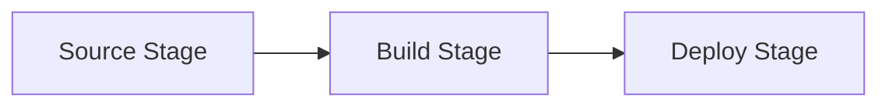
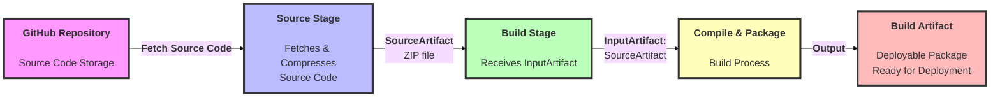
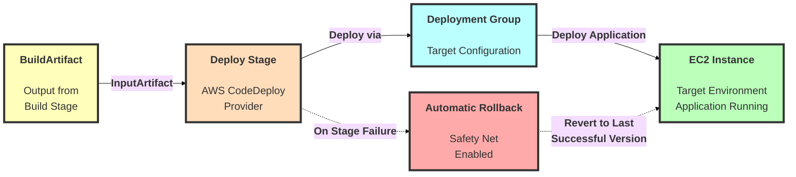

# Build a CI/CD Pipeline with AWS

**Project Link:** [View Project](http://learn.nextwork.org/projects/aws-devops-codepipeline-updated)

**Author:** Ngurah Gede Wisnu Gudakesa  
**Email:** ngurahgedewisnugk@gmail.com

---


---

## Introducing Today's Project!

In this project, I will demonstrate how to build an automated CI/CD pipeline with AWS CodePipeline. I'm doing this project to learn how to orchestrate a continuous integration and continuous deployment workflow system, making deployments consistent, reliable, and fully automated.

## 🛠️ Key Tools and Concepts

### **AWS Services Used:**

| Service | Purpose |
|---------|---------|
| **CodePipeline** | Orchestrates the entire CI/CD workflow |
| **CloudFormation** | Infrastructure as Code (IaC) for resource provisioning |
| **CodeArtifact** | Manages dependencies |
| **CodeBuild** | Compiles and packages code |
| **CodeConnection** | Links GitHub repository to AWS |
| **CodeDeploy** | Handles deployments to EC2 instances |
| **IAM** | Service roles and permissions management |

### **Key Concepts Learned:**

- ✅ Building a full CI/CD pipeline using AWS services
- ✅ Infrastructure as Code (IaC) with CloudFormation
- ✅ Dependency management with CodeArtifact
- ✅ Source control integration via CodeConnection
- ✅ Automated build and deployment processes
- ✅ **Deployment Rollbacks** for disaster recovery
- ✅ Service Roles and Execution Modes
- ✅ Ensuring operational resilience


### Project reflection

> **Duration:** ~3 hours

The most challenging aspect was gaining a deep understanding of the application's version state within CodePipeline and the [IAM rollback policy required for CodePipeline to trigger a rollback with CodeDeploy](https://github.com/ngurahgdewisnugk/7-Days-Devops-Challange/blob/main/07%20-%20Build%20a%20CICD%20Pipeline%20with%20AWS/Build%20a%20CICD%20Pipeline%20with%20AWS.md#-challenge-fixing-rollback-permissions). Successfully resolving these issues and completing the challenge was incredibly rewarding!

---

## Starting a CI/CD Pipeline


AWS CodePipeline is a service that creates an automated workflow to move your code changes through the build and deployment stages. It ensures that a new push to your repository automatically triggers a build with CodeBuild and then a deployment with CodeDeploy. This makes your deployments consistent, reliable, and automatic, reducing manual effort and errors.

### **Execution Modes:**


I chose **Superseded Mode** for this project to ensure only the latest code changes are processed.

| Mode | Description | Use Case |
|------|-------------|----------|
| **Superseded** | Only latest changes processed | Fast-moving development |
| **Queued** | Sequential execution processing | Order-dependent deployments |
| **Parallel** | Multiple executions run simultaneously | Microservices architecture |

### **Service Role:**


A service role is automatically created during setup, allowing CodePipeline to:
- Access S3 buckets for storing artifacts
- Trigger CodeBuild for building and packaging code
- Invoke CodeDeploy for deployments
- Automate processing actions across related services

---

## CI/CD Stages



The three core stages I've set up in my CI/CD pipeline are:
1.  **Source Stage**: This stage is responsible for fetching the latest version of my 
    code from my GitHub repository.
2. **Build Stage**: Here, AWS CodeBuild compiles and packages the source code 
    into ready-to-deploy artifacts.
3. **Deploy Stage**: In this final stage, AWS CodeDeploy takes the application 
    artifacts from the Build stage and deploys them to the target environment.

### Pipeline Settings
While setting up the pipeline, I also learned about important pipeline execution settings like the Superseded mode, which ensures only the latest code changes are processed. This is a crucial overall pipeline configuration, separate from the specific actions within each stage.


### **Pipeline Status Indicators:**
The pipeline organizes the three stages (Source, Build, Deploy) into a single diagram, visually showcasing the flow of changes. For each stage, the pipeline provides real-time status updates: 

- 🔘 **Grey** - Not started
- 🔵 **Blue** - In progress
- 🟢 **Green** - Successful
- 🔴 **Red** - Failed

This allows me to monitor the progress and health of each part of the pipeline.


---

## 📑 Source Stage

Specifying the **default branch** (e.g., `main`) tells CodePipeline to monitor that branch for any new commits or pushes. When changes are detected, it automatically triggers pipeline execution.


### :bell: **Webhook Events:**

Webhooks are crucial for automation:

> 💡 **Think of webhooks as digital notifications:** When changes occur on the monitored branch in GitHub, GitHub sends a notification to CodePipeline, which triggers the pipeline in real-time.

**Benefits:**
- ⚡ Real-time pipeline triggering
- 🔄 Truly continuous integration
- 🤖 Fully automated CI/CD process


---

## 📦 Build Stage

### :arrows_clockwise: Build Pipeline Flow

## Flow Description

1. **GitHub Repository** - Contains the source code

2. **Source Stage** - Fetches and compresses source code as ZIP file (SourceArtifact)

3. **Build Stage** - Receives SourceArtifact as InputArtifact

4. **Compile & Package** - Processes the code

5. **Build Artifact** - Final deployable package ready for deployment


---

## :rocket: Deploy Stage

### :arrows_clockwise: Deploy Pipeline Flow 



### Deploy Stage Flow Description

1. **BuildArtifact** - Output from the Build stage, ready for deployment

2. **Deploy Stage** - AWS CodeDeploy configured as the deploy provider, receives BuildArtifact as InputArtifact

3. **Deployment Group** - Specific deployment group configuration that targets the EC2 instance

4. **EC2 Instance** - Target environment where the application is deployed and running

### 🔒 Safety Mechanism (Dotted Lines)

1. **Automatic Rollback** - Enabled on stage failure to ensure reliability

* Triggers when deployment fails

* Reverts to the last successful version

* Provides a safety net for deployments

**Benefits:**
- 🛡️ Deployment reliability
- 🔄 Quick disaster recovery
- ✅ Maintains application stability


---

## Success!🎉

### **Testing the Pipeline:**

I added the following line to the `<body>` section of `index.jsp`:

```html
<p>If you see this line, that means your latest changes are automatically deployed into production by CodePipeline!</p>
```

**Commit Message:**
```
Update index.jsp with a new line to test CodePipeline
```

### **CI/CD Pipeline end-to-end Execution:**

1. ✅ Pushed code change to GitHub
2. ✅ Pipeline automatically triggered
3. ✅ Commit message reflected in Source stage
4. ✅ Each stage transitioned: 🔵 Blue (in progress) → 🟢 Green (success)
5. ✅ New version deployed to production

### **Verification:**
Once my pipeline executed successfully, I checked my web app index, and confirming that the new line I added to the `index.jsp` file was visible. This directly demonstrates that CodePipeline automatically deployed my latest changes.


---
## 🎯 Challenge: Fixing Rollback Permissions

### **The Problem**

While testing the pipeline rollback functionality, I encountered an IAM permissions error that prevented CodePipeline from performing rollbacks, even though deployments worked perfectly.


### **Symptoms:**
- ✅ Deployments work successfully
- ❌ Rollbacks fail with permission errors
- ⚠️ CodePipeline cannot retrieve previous application versions

---
### **Root Cause Analysis**

The CodePipeline service role lacked explicit permission to retrieve application revisions from CodeDeploy. This permission is **essential** for rollbacks because:

> 💡 **Key Insight:** During a rollback, CodePipeline needs to query CodeDeploy to identify which previous version to revert to. Without the `codedeploy:GetApplicationRevision` permission, CodePipeline cannot access the deployment history, making rollbacks impossible.
---
### **Solution: Adding IAM Permissions**

To fix this issue, I added an inline policy to the CodePipeline service role granting the necessary permissions.

#### **Step-by-Step Resolution:**

##### **1. Navigate to IAM Console**
- Open the AWS IAM Console
- Select **Roles** from the left-hand navigation pane

##### **2. Locate the Service Role**
Search for and click on:
```
AWSCodePipelineServiceRole-ap-southeast-2-nextwork-devops-cicd
```

##### **3. Create Inline Policy**
- Click **Add permissions** → **Create inline policy**
- Select the **JSON** tab

##### **4. Add Permission Policy**
**Policy Breakdown:**

| Component | Value | Purpose |
|-----------|-------|---------|
| **Effect** | Allow | Grants permission |
| **Action** | `codedeploy:GetApplicationRevision` | Allows retrieving deployment history |
| **Resource** | Application ARN | Limits scope to specific CodeDeploy application |

##### **5. Review and Create**
- Click **Review policy**
- Name the policy: `CodePipelineCodeDeployRollbackPolicy`
- Click **Create policy**


#### **Before vs After:**

| Capability | Before Fix | After Fix |
|------------|------------|-----------|
| Deploy | ✅ Working | ✅ Working |
| Rollback | ❌ Failed | ✅ Working |
| Get Revisions | ❌ Unauthorized | ✅ Authorized |

---

### **Key Takeaways**

🔑 **Lessons Learned:**

1. **Principle of Least Privilege:** AWS IAM follows least privilege by default - permissions must be explicitly granted
2. **Service Role Scope:** Different pipeline operations require different permissions
3. **Rollback Requirements:** Rollbacks need read access to deployment history
4. **Inline Policies:** Useful for adding specific, granular permissions to existing roles
5. **Testing is Critical:** Always test both deployment and rollback scenarios

---

## Testing the Pipeline

I initiated a rollback on the **Deploy Stage** of the pipeline. This is crucial for disaster recovery, allowing us to quickly revert to a previously deployed, stable version of the source code in case of deployment failures or issues.


### **Rollback Behavior:**
| Stage | Affected? | Reason |
|-------|-----------|--------|
| **Source** | ❌ No | Source code in GitHub remains unchanged |
| **Build** | ❌ No | Build artifacts remain unchanged |
| **Deploy** | ✅ Yes | Application reverts to previous stable version |

> 🔄 **Key Insight:** During a rollback, only the Deploy stage is affected. The rollback specifically targets the application on the EC2 instance, reverting it to a previous successful deployment without altering source code or build artifacts.

### **Verification:**

After the rollback, I observed that:
- ✅ Live web application successfully reverted to previous stable version
- ✅ Recent deployment changes were no longer visible
- ✅ Application restored to known good state

This confirms that the rollback mechanism effectively provides disaster recovery capabilities!


---

<div align="center">
  
  **Made with ☁️**
  
  *Automated CI/CD Pipeline with AWS*
  
  ---
  
  ### 🚀 Pipeline Flow Summary
  
  ```
  GitHub Push → Source Stage → Build Stage → Deploy Stage → Production
                    ↓              ↓              ↓
                Webhook      CodeBuild      CodeDeploy
                              ↓              ↓
                         Artifacts    Rollback Ready
  ```
  
</div>
